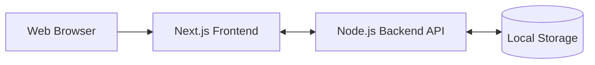

# โครงงาน Re-wear (แพลตฟอร์มส่งต่อเสื้อผ้ามือสอง)

**ชื่อกลุ่ม:** หมากัดเอกชัย

**สมาชิกในกลุ่ม:**
1. 67154952 นางสาว พิมพ์มาดา คงดี (UX/UI, frontend)
2. 67155008 นาย วรานนท์ โสปรก (backend, tester)
3. 67152565 นาย ณัฐพงศ์ หาญชัยภา (frontend, backend)

## 📌 หลักการและเหตุผล
การขายเสื้อผ้ามือสองผ่านช่องทางโซเชียลมีเดียมักเจอปัญหาลูกค้าแย่งกันพิมพ์ CF สินค้าที่มีชิ้นเดียว ทำให้จัดการยาก อาจเกิดการซื้อหรือโอนเงินซ้ำซ้อน กลุ่มของเราจึงต้องการพัฒนาระบบ e-Commerce ที่ออกแบบมาเพื่อแก้ปัญหานี้ เพื่อลดความผิดพลาด และช่วยจัดการร้านได้ง่ายขึ้น

## 🛠 ขอบเขตของระบบ
* **ระบบจัดการสมาชิก:** รองรับการสมัครสมาชิกและเข้าสู่ระบบ
* **ระบบหน้าร้าน:** ลูกค้าสามารถค้นหาสินค้า และดูรายละเอียดเสื้อผ้ามือสองได้
* **ระบบตะกร้าสินค้าและการสั่งซื้อ:** ลูกค้าสามารถเพิ่มสินค้าลงตะกร้าและสั่งซื้อได้
* **ระบบจัดการคลังสินค้าและออเดอร์:** พนักงานสามารถเพิ่ม ลบ หรือแก้ไขสินค้าได้
* **ระบบหลังบ้าน:** ระบบสามารถแสดงผล Dashboard รายงานข้อมูลให้พนักงานและผู้ดูแลระบบได้

## 💻 เครื่องมือและเทคโนโลยีที่ใช้
* **Frontend:** Next.js
* **Backend:** Node.js
* **Database:** Local Storage
* **Tools:** Figma, GitHub, Draw.io, Lucidchart

## 📐 System Architecture

## 🎯 วัตถุประสงค์ของโครงงาน
1. พัฒนาระบบด้วย Next.js และ Local Storage ให้ประยุกต์ใช้งานจริงได้
2. แก้ปัญหาการพิมพ์ซื้อซ้ำซ้อนจากลูกค้าหลายคน
3. เพื่อศึกษาเทคโนโลยี e-Commerce สำหรับเสื้อผ้ามือสอง

## 🧪 แนวทางการทดสอบระบบ (Testing Approach)
* **เครื่องมือที่ใช้:** Manual Testing
* **รายละเอียดการทดสอบ:** ไม่วัดผลการใช้เครื่องมือทดสอบอัตโนมัติหรือมีการจัดทำรายงานผลการทดสอบอย่างเป็นทางการ การทดสอบการทำงานของระบบด้วยตนเองตามฟังก์ชันที่พัฒนา พร้อมสาธิตการทำงานต่อผู้สอน โดยอธิบายขั้นตอนการทดสอบผลลัพธ์ที่คาดหวังและผลลัพธ์ที่เกิดขึ้นจริง เพื่อแสดงให้เห็นว่าระบบทำงานได้ถูกต้องตามวัตถุประสงค์ที่กำหนดไว้

## 🏆 ผลลัพธ์ที่คาดว่าจะได้รับ (Expected Outcomes)
1. ได้ระบบ e-Commerce ที่ออกแบบมาเพื่อแก้ปัญหาสำหรับพ่อค้าแม่ค้าออนไลน์
2. ค้นพบและประยุกต์ใช้ Local Storage เก็บข้อมูลทดแทนฐานข้อมูลจริงได้
3. เข้าใจโครงสร้างและพัฒนา Web Application ด้วย Next.js
4. ได้เรียนรู้กระบวนการทำงานร่วมกันผ่าน Version Control เช่น GitHub

## 📅 แผนการดำเนินงาน 4 สัปดาห์ (Work Plan)
* **สัปดาห์ที่ 1 (Analysis & Design):** รวบรวม Requirement ของ Actors, ออกแบบ Wireframe/UI, ออกแบบโครงสร้าง JSON, การทำงานตามแนวคิด MVC, พร้อมสร้าง Repository บน GitHub
* **สัปดาห์ที่ 2 (Frontend Development):** พัฒนาหน้าเว็บ (ลูกค้า, พนักงาน, ผู้ดูแลระบบ) ตามที่ได้ออกแบบไว้ เชื่อมโยงหน้าต่างให้ถูกต้อง
* **สัปดาห์ที่ 3 (Backend & Database Development):** พัฒนาระบบ API, จัดการ Logic เชื่อมต่อฐานข้อมูล JSON, และหน้า Dashboard ของแต่ละ Role, พร้อมเชื่อมต่อ Local Storage
* **สัปดาห์ที่ 4 (Testing & Presentation):** ทบทวนความสมบูรณ์ นำเสนอ และปรับแก้ข้อผิดพลาด ทดสอบ UAT เพื่อยืนยันความถูกต้อง ส่ง Git Commit และทำคู่มือใช้งานระบบ
